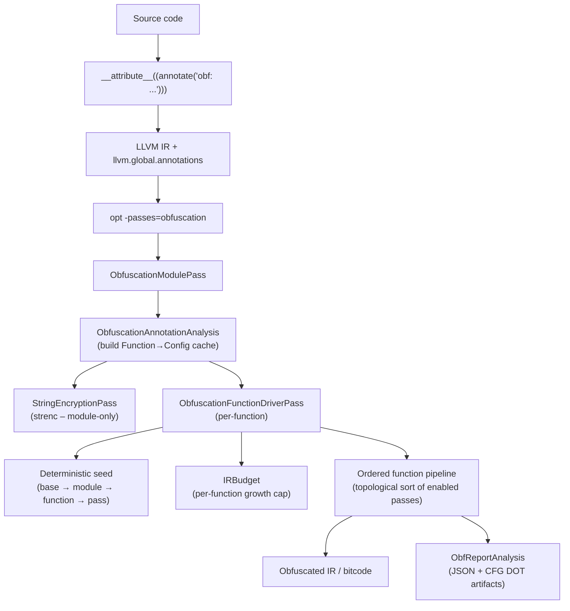

# LLVM Obfuscator (LLVM 22, in-tree) — MOVED

> [!IMPORTANT]
> **This project now lives at 👉 https://github.com/und3ath/xollvm**
>
> This tree is the **legacy in-tree fork**, kept for reference only. New work happens in
> **xollvm**.
>
> **Why the move:** the in-tree design forced the obfuscator to live *inside* an LLVM
> checkout — you had to fork the monorepo, patch `PassBuilder.cpp` / `PassRegistry.def` /
> the CMake files, and rebuild all of LLVM just to change a pass. Every LLVM release meant
> re-rebasing the fork. **xollvm** drops all of that: it is **fork-free with zero LLVM source
> edits**, plugging into **stock LLVM** as a static extension (`LLVM_EXTERNAL_PROJECTS`) or a
> loadable `-fpass-plugin` (`Obfuscator.so`). Same passes, no monorepo pain.

<p align="center">
  
</p>

An **in-tree** LLVM obfuscation framework integrated into the **new pass manager** (NPM).
Configuration is driven by **source-level annotations** (`llvm.global.annotations`) and resolved once per module into a cached, deterministic configuration map.

> **Disclaimer / Legal:** This project is intended for *legitimate* software protection use-cases
> (IP protection, anti-tamper research, academic evaluation, CTFs with permission, etc.).
> **Do not use it for malware, unauthorized access, or to violate laws / terms of service.**
> You are responsible for compliance with all applicable laws and regulations.

> [!IMPORTANT]
> Obfuscation is not a security boundary. Treat it as one layer in a broader defensive strategy
> (hardening, anti-tamper, secure update, key management, etc.).

---

## What you get

- **Module entry pass**: `-passes=obfuscation`
  - Runs module-only work (currently `strenc`) then drives an ordered per-function pipeline.
- **Annotation-driven config** with canonical pass IDs + aliases.
- **Deterministic seeding** (module → function → pass) with an optional seed manifest.
- **Safety rails**: instruction/block/loop-depth gating + **IR growth budgeting** to avoid runaway transforms.
- **Diagnostics**
  - `-passes=obf-dump-config` to print the resolved config per function.
  - `-passes=obf-metrics` to emit JSONL metrics per function.
- **Obfuscation reports**
  - JSON obfuscation map + per-pass CFG snapshots/diffs.
  - HTML viewer generator (Python) for debugging and transformation inspection.
- **Runtime test suite** (Python) with optional report generation.

---

## Passes (high level)

Function pipeline — order is enforced by the pipeline driver (topological sort):

| Pass | ID | Category | Description |
|---|---|---|---|
| Mixed Boolean/Arithmetic | `mba` | Expression | Rewrites integer expressions as MBA equivalents. |
| Instruction substitution | `substitution` | Expression | Replaces instructions with semantically equivalent idioms. |
| Virtual call | `vcall` | Call hardening | Virtualises direct calls via synthetic vtables and indirection. |
| Basic block split | `split` | CFG | Splits basic blocks to increase graph complexity. |
| Semantic diffusion | `sdiff` | Expression / CFG | Volatile-slot masking that resists local simplification. |
| Bogus control flow | `bcf` | CFG | Adds opaque predicates and fake edges. |
| CFG flattening | `flattening` | CFG | Replaces structured control flow with a dispatcher/state machine. |
| Anti-optimization shield | `shield` | Post-hardening | Inserts volatile barriers and opaque identities. |
| Anti-decompiler | `adec` | Post-hardening | Indirectbr trampolines, asm junk bytes, pointer aliasing. |
| **Code virtualisation** | **`vm`** | **Virtualisation** | **Compiles the function body into a private bytecode stream interpreted at runtime.** |

Module-only:

| Pass | ID | Description |
|---|---|---|
| String encryption | `strenc` | Encrypts string literals; enabled when any annotated function includes `strenc(...)`. |

> [!NOTE]
> `vm` conflicts with `flattening` (both completely restructure the CFG).
> Use one or the other, not both, on the same function.

---

## Quick start

### 1) Build LLVM with the obfuscator

This project lives **inside** an LLVM 22 checkout (branch `ollvm-22.x`).
The `ollvm-21.x` branch tracks LLVM 21 and is maintained in parallel.

**Linux / macOS (Ninja, Release):**

```bash
cmake -S llvm -B build -G Ninja \
  -DLLVM_ENABLE_PROJECTS="clang;lld" \
  -DLLVM_ENABLE_RTTI=ON \
  -DLLVM_ENABLE_EH=ON \
  -DCMAKE_BUILD_TYPE=Release

cmake --build build --target opt clang
```

**Windows — MSVC, Debug (assertions on):**

```bat
cd llvm-project && mkdir build && cd build

cmake -G "Visual Studio 17 2022" ^
  -DLLVM_ENABLE_PROJECTS="llvm;clang" ^
  -DLLVM_ENABLE_RTTI=ON ^
  -DLLVM_ENABLE_EH=ON ^
  -DLLVM_TARGETS_TO_BUILD="X86" ^
  -DLLVM_INCLUDE_TESTS=ON ^
  -DLLVM_BUILD_TESTS=OFF ^
  -DLLVM_INCLUDE_BENCHMARKS=OFF ^
  -DLLVM_BUILD_BENCHMARKS=OFF ^
  -DCMAKE_MSVC_RUNTIME_LIBRARY=MultiThreadedDLL ^
  -DLLVM_ENABLE_ASSERTIONS=ON ^
  -DCMAKE_BUILD_TYPE=Debug ^
  -DCMAKE_EXPORT_COMPILE_COMMANDS=ON ^
  ..\llvm

cmake --build . --config Debug
```

**Windows — MSVC, Release:**

```bat
cmake -G "Visual Studio 17 2022" ^
  -DLLVM_ENABLE_PROJECTS="llvm;clang" ^
  -DLLVM_ENABLE_RTTI=ON ^
  -DLLVM_ENABLE_EH=ON ^
  -DLLVM_TARGETS_TO_BUILD="X86" ^
  -DLLVM_INCLUDE_TESTS=ON ^
  -DLLVM_BUILD_TESTS=OFF ^
  -DLLVM_INCLUDE_BENCHMARKS=OFF ^
  -DLLVM_BUILD_BENCHMARKS=OFF ^
  -DCMAKE_MSVC_RUNTIME_LIBRARY=MultiThreadedDLL ^
  -DLLVM_ENABLE_ASSERTIONS=OFF ^
  -DCMAKE_EXPORT_COMPILE_COMMANDS=ON ^
  ..\llvm

cmake --build . --config Release
```

To target additional architectures add: `-DLLVM_TARGETS_TO_BUILD="X86;AArch64;ARM;RISCV"`

---

### 2) Annotate functions

**C example:**

```c
// Light: expression-level only
__attribute__((annotate("obf: mba(prob=70,maxDepth=3), substitution(loop=2)")))
int light(int x) { return x * 3 + 7; }

// Heavy: structural + post-hardening
__attribute__((annotate("obf: mba(prob=70), bcf(prob=30,loop=1), flattening(minBlocks=3), shield, adec(prob=60)")))
int heavy(int x, int y) { return x ^ y; }

// Maximum: VM virtualisation (replaces the entire function body)
__attribute__((annotate("obf: vm(hardened=1,useAES=1,regEncrypt=1)")))
int secret(int key, int data) { return key ^ (data + 0xDEAD); }

// Module-level string encryption (triggered by annotation on any function)
__attribute__((annotate("obf: strenc(minlen=4)")))
void init(void) { puts("initializing..."); }
```

**C++ example:**

```cpp
[[clang::annotate("obf: mba(prob=60), bcf(prob=25), flattening(minBlocks=4)")]]
static int compute(int a, int b) { return a * b - (a ^ b); }
```

---

### 3) Run the module pipeline

**Using `opt`:**

```bash
# 1) Compile to IR
clang -S -emit-llvm -O0 -g test.c -o test.ll

# 2) Run the obfuscator
opt -passes=obfuscation -S test.ll -o test.obf.ll \
  -obf-seed=1 -obf-deterministic -obf-verify

# 3) Compile to native
clang test.obf.ll -O2 -o test.obf
```

**Using `clang` directly (in-tree build):**

```bash
clang test.c -O2 \
  -mllvm -passes=obfuscation \
  -mllvm -obf-seed=1 \
  -mllvm -obf-deterministic \
  -o test.obf
```

---

### 4) Inspect config / metrics (optional)

```bash
# Print resolved pass list + params per function
opt -passes=obf-dump-config -S test.ll -o /dev/null -obf-verbose -obf-seed=1

# Emit JSONL metrics per function
opt -passes=obf-metrics -S test.ll -o /dev/null > metrics.jsonl
```

---

## How the pipeline works



---

## Reproducibility

Use a fixed seed to make builds deterministic:

- `-obf-seed=<N>` — non-zero value pins the base seed.
- `-obf-deterministic` — when seed is 0, derives the module seed from a stable hash of the module
  identifier instead of `std::random_device`.

Seeds cascade: `base → module → function → pass`. Per-pass seeds are derived from the function seed
and the pass ID string, so each pass in each function gets a unique but reproducible stream.

Dump the full seed manifest for later reproduction:

```bash
opt -passes=obfuscation -S test.ll -o test.obf.ll \
  -obf-seed=42 -obf-seed-manifest=seeds.json
```

---

## Documentation

| Document | Purpose |
|---|---|
| [README.md](README.md) | This file — quick start and overview. |
| [USER.md](USER.md) | Usage guide: annotation grammar, pass reference, global options, reports, troubleshooting. |
| [DEV.md](DEV.md) | Architecture notes: pass registration, annotation cache, pipeline ordering, reporting, correctness, adding passes. |
| [VM.md](VM.md) | **Dedicated VM pass reference** — ISA, bytecode format, hardening layers, configuration, interaction with other passes. |
| [TESTS.md](TESTS.md) | Runtime test harness, categories, debug workflows, adding tests. |

---

## License

See `LICENSE` / LLVM licensing in the parent project.
