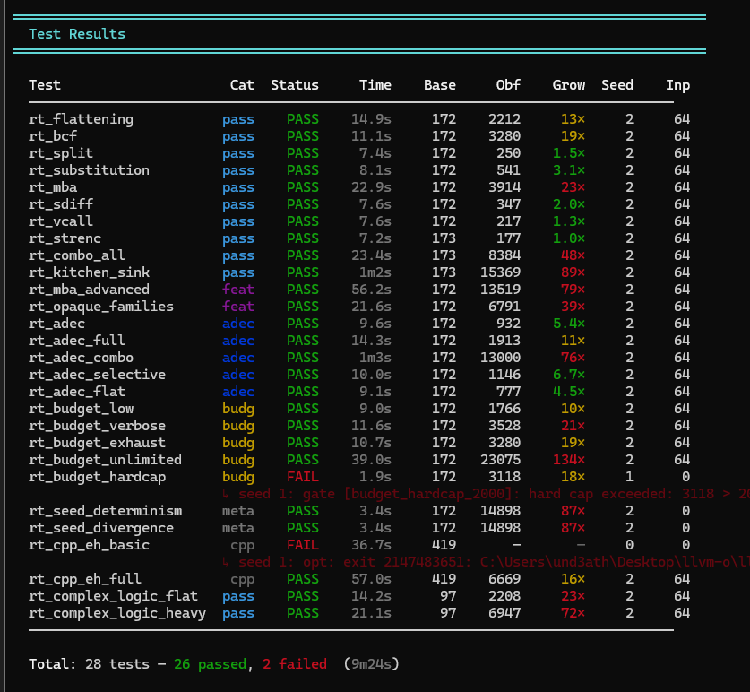
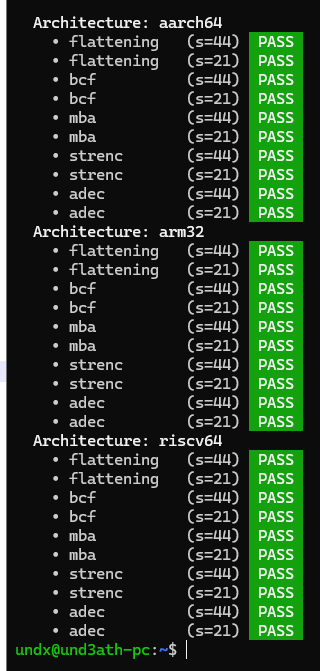
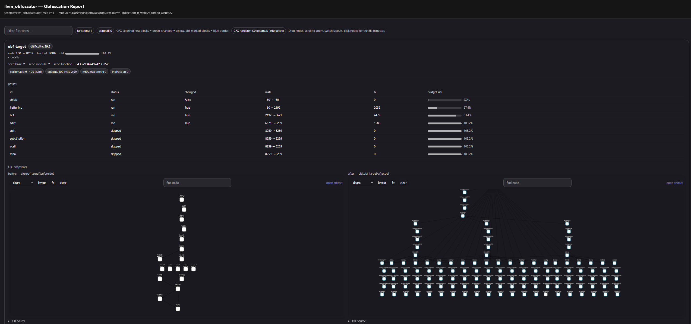
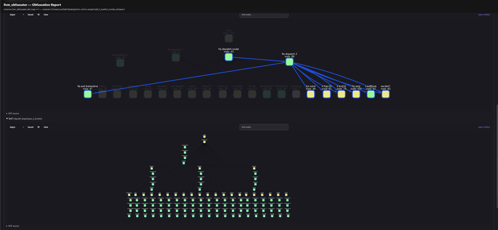

# TEST SUITE

The project ships a **runtime regression suite** to catch:

- IR correctness regressions (miscompiles)
- Pass interaction issues
- Performance pathologies (within the scope of the suite)
- Report generation regressions

The harness compiles small generated programs, runs baseline vs. obfuscated variants,
compares results, and optionally verifies that the obfuscated IR survives a subsequent
`-O2` pipeline without semantic changes.

---

## Entry points

Scripts live in:

- `llvm/utils/obfuscator/obf_runtime_test.py` — core test runner
- `llvm/utils/obfuscator/obf_runtime_tests_with_reports.py` — test runner with obfuscation report generation

---

## Prerequisites

- A built LLVM tree containing `opt` and `clang` (the in-tree build that includes the obfuscator).
- Python 3.10+
- Optional (recommended): Graphviz (`dot`) for offline HTML report rendering.

---

## Basic run

```bash
python llvm/utils/obfuscator/obf_runtime_test.py \
  --build-dir <path-to-llvm-build> \
  --config Release \
  --seeds 1,2,3 \
  --inputs 24
```





### Useful flags (`obf_runtime_test.py`)

| Flag | Description |
|---|---|
| `--list` | List all available test cases and categories, then exit. |
| `--filter <pattern>` | Run only tests whose name contains the pattern. |
| `--category <name>` | Restrict to one category: `pass`, `feature`, `budget`, `adec`, `meta`. |
| `--seeds 1,2,3` | Run each test with multiple seeds (comma-separated). |
| `--inputs N` | Number of randomized input pairs per test (default 24). |
| `--quick` | Reduce to 8 inputs for fast iteration. |
| `--o2-gate` | After obfuscation, run the IR through `-O2` and verify semantics are preserved. |
| `--no-metrics` | Skip `obf-metrics` collection. |
| `--no-gates` | Skip IR feature-gate checks. |
| `--work <dir>` | Use a stable work directory (useful for inspecting artifacts). |
| `--keep` | Preserve work directory on success (normally cleaned up). |
| `--verbose` / `-v` | Print all subprocess commands. |
| `--json-report <path>` | Write a JSON summary of test results to this path. |
| `--no-color` | Disable colored terminal output. |

> [!TIP]
> When debugging a regression, always pin a seed (e.g., `--seeds 1`) and use `--work` with a
> stable path so you can inspect intermediate artifacts.

---

## Run with automatic report generation

`obf_runtime_tests_with_reports.py` emits an **obfuscation map + CFG artifacts** for every
obfuscation run, and can optionally generate HTML viewers.

```bash
python llvm/utils/obfuscator/obf_runtime_tests_with_reports.py \
  --build-dir <path-to-llvm-build> \
  --config Release \
  --seeds 1 \
  --inputs 16 \
  --obf-report \
  --obf-report-out ./obf_reports
```

### Report flags (`obf_runtime_tests_with_reports.py`)

| Flag | Description |
|---|---|
| `--obf-report` | Enable `-obf-report-dir` for each obfuscation run. |
| `--obf-report-out <dir>` | Root directory for reports (default `./obf_reports`). |
| `--obf-report-no-html` | Skip HTML generation (still emits JSON + DOT files). |
| `--obf-report-tool <path>` | Path to `obf_report_html.py` (auto-detected if empty). |

The harness creates per-test subdirectories:

```
obf_reports/
  <test-name>/
    obf_report.json
    cfg/<function>/before.dot
    cfg/<function>/after.dot
    cfg/<function>/per_pass/<pass>/after.dot
    cfg/<function>/per_pass/<pass>/diff.dot
    obf_report.html          (when HTML generation is enabled)
  index.html                 (top-level index linking all test reports)
```





---

## Test categories

| Category | What it tests |
|---|---|
| `pass` | Individual and combo pass correctness (each enabled pass exercised in isolation and in combination). |
| `feature` | Advanced MBA transformations, opaque-predicate families, layered features. |
| `adec` | Anti-decompiler patterns. |
| `budget` | IR instruction budget system: budget caps, skip-on-exhaustion, multiplier knobs. |
| `meta` | Seed determinism (same seed → same output), seed divergence (different seeds → different output). |

The `vm` pass test cases fall under the `pass` category and include:

- Basic correctness: arithmetic, logic, comparisons, returns.
- Integer widths: i8, i16, i32, i64 through all four register files.
- Float support: f32 and f64 arithmetic, comparisons, conversions.
- Control flow: conditionals, loops, switch statements.
- Call handling: direct calls, variadic calls, multi-type argument lists.
- Hardening layers: `obfRegIdx`, `encBytecode`, `useAES`, `regEncrypt`.
- Interaction combos: `vm` after `mba`; `vm` after `bcf`; `vm` + `shield`.
- Eligibility gates: functions that should be skipped (EH, callbr, etc.).

---

## Debug workflows

### 1) Bisect pass interactions

If a combo test fails, reduce to minimal reproduction:

1. Re-run the failing test with a fixed seed and `--work`:
   ```bash
   python obf_runtime_test.py --build-dir build --seeds 1 --work /tmp/obf_work \
     --filter "failing_test_name" --keep
   ```
2. Turn off all passes except one. Most test cases group passes in their annotation string.
3. Add passes back incrementally until the failure reproduces.

### 2) Use the report to find the introducing pass

Enable report generation on the failing test and open the HTML viewer:

- Navigate to the failing function.
- Look at `passes[]` in the JSON or the HTML pass table:
  - Which pass first shows a large CFG delta?
  - Which pass triggers a budget spike?
  - Which pass has a skip reason?
- Examine the `diff.dot` for the introducing pass to see exactly which blocks and edges changed.

### 3) O2 gate failures

If `--o2-gate` fails:

- Check whether a pass relies on UB or assumes no further optimization will occur.
- Confirm that inserted `volatile` loads/stores and opaque predicates are truly
  optimization-resistant under the specific LLVM 21 optimizer passes.
- Inspect the diff DOT: often a critical edge or block was removed/merged by `simplifycfg`
  or `instcombine`.
- For `vm`: the wrapper must use `volatile` on the IP and salt allocas; verify this in the
  emitted IR.

### 4) VM-specific debugging

For `vm` pass failures:

```bash
# Check eligibility decisions and bytecode sizes
opt -passes=obfuscation -S test.ll -o /dev/null \
  -obf-seed=1 -obf-verbose 2>&1 | grep '\[vm\]\|\[obf\]'

# Confirm the vm pass ran (look for __vm_engine and .vm.bytecode globals)
grep -c 'vm.bytecode\|__vm_engine' test.obf.ll

# Verify the obfuscated IR is valid
opt -passes=verify test.obf.ll -o /dev/null
```

If the function was skipped, look for the skip reason in verbose output or the report JSON.

---

## Adding a new test case

The suite is code-driven — test cases are constructed in the Python script.

**Typical additions:**

```python
TestCase(
    name="my_new_test",
    category="pass",
    passes=["mba", "bcf"],          # annotation is generated from this
    # ann_override="mba(prob=50)",  # optional: override generated annotation
    # gates=["OP_BINOP"],           # optional: IR feature gates to verify
)
```

**Adding a VM-specific test:**

```python
TestCase(
    name="vm_float_ops",
    category="pass",
    passes=["vm"],
    ann_override="vm(useAES=1,obfRegIdx=1)",
    # The test harness uses a code template that exercises float arithmetic
)
```

Keep test cases:

- **Small** — fast to compile and run (stay under a few hundred IR instructions).
- **Deterministic** — given the same input, the function returns a defined result.
- **Diagnostic** — easy to attribute failures to a specific pass or interaction.
- **Typed** — exercise the specific IR pattern you care about (e.g., use `long long` inputs
  to exercise 64-bit register paths in the VM).
